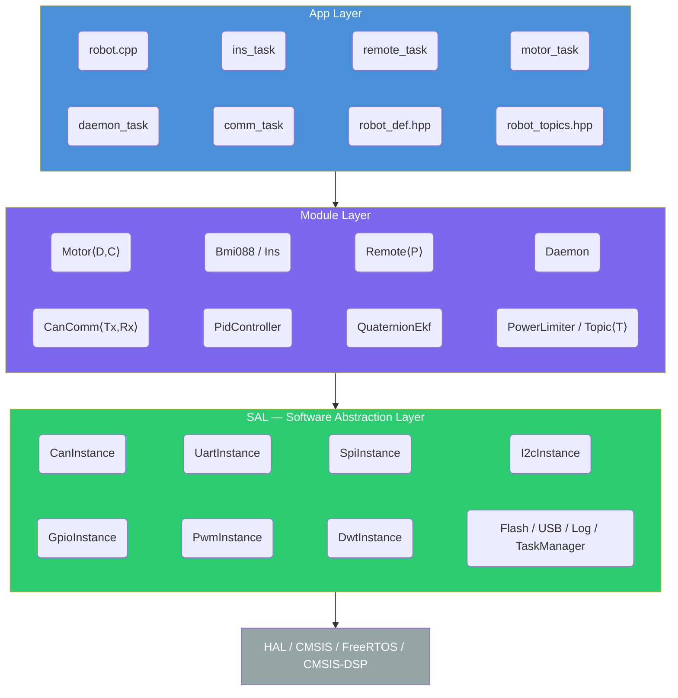
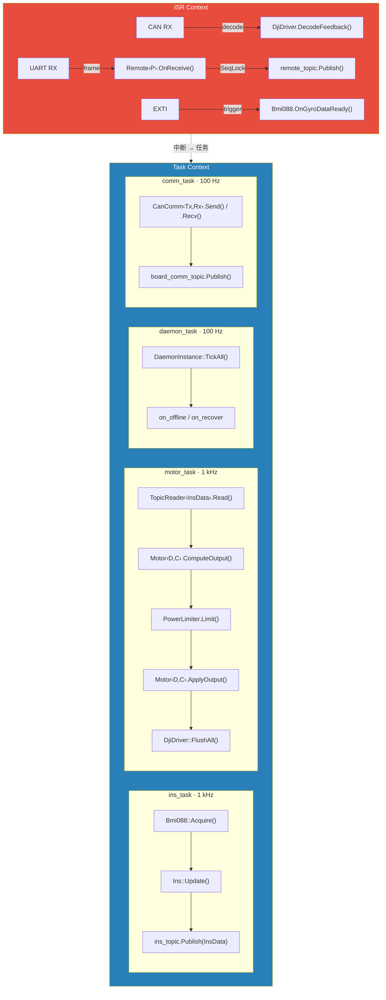
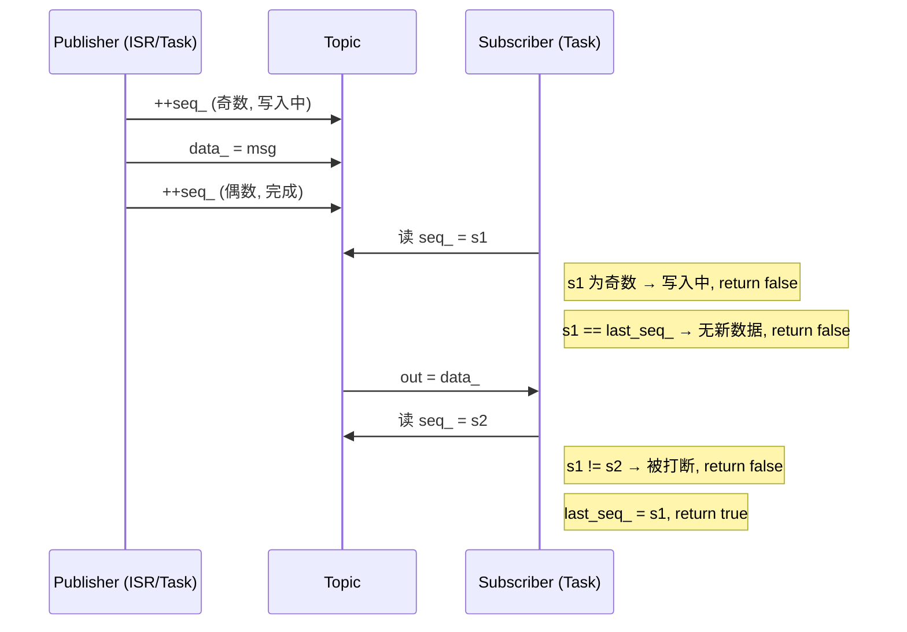
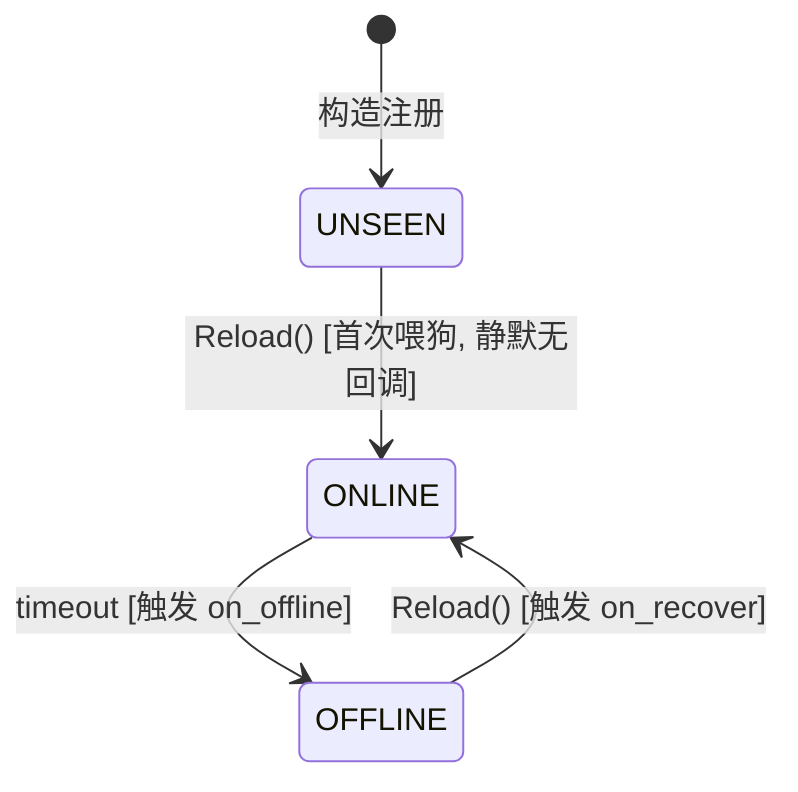
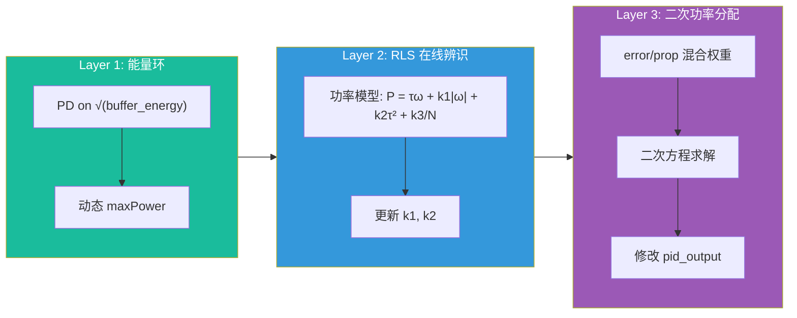

# RMEC

常州大学 RoboMaster 2025-2026 赛季 C++ 嵌入式控制框架。

<p>
  
  
  
  
  
</p>

> 基于 [basic_framework](https://gitee.com/hnuyuelurm/basic_framework) 的 C++ 现代化重构。零虚函数模板组合设计、SeqLock 无锁发布订阅、编译期接口契约检查——在保持嵌入式资源约束的前提下，将现代 C++ 的类型安全与零开销抽象引入 RoboMaster 电控开发。

[TOC]

---

## 1 项目概述

### 1.1 设计动机

basic_framework 以 C 语言实现了 bsp → module → app 三层架构，在 RM 社区取得了广泛应用。但随着机器人功能复杂度提升，C 语言的局限性逐渐显现：

- **类型安全缺失**：void 指针回调、裸 union 转换导致的隐性错误
- **代码复用困难**：电机驱动与控制算法无法正交组合，新增电机类型需要大量复制粘贴
- **并发保护薄弱**：跨任务数据读写依赖人工纪律，缺少系统性机制

RMEC 针对上述痛点，以 C++17 重新设计了整套架构。

### 1.2 核心设计决策

| 决策 | 选择 | 理由 |
|------|------|------|
| 语言标准 | C++17 | `inline constexpr`、`if constexpr`、结构化绑定、`std::is_trivially_copyable_v` |
| 多态方式 | 模板组合 (静态多态) | 零虚函数表开销，编译器可完全内联控制算法 |
| 跨任务通信 | SeqLock 无锁 Topic | 单生产者多消费者，ISR 安全，零动态内存 |
| 编译期检查 | `static_assert` + concepts-lite | 接口不满足时给出清晰错误信息，而非模板展开错误 |
| 构建系统 | CMake + Ninja | 并行编译，compile_commands.json 支持 clangd |
| 离线检测 | FSM + 时间戳 (Daemon) | 确定性边沿触发，ISR 单原子写零竞态 |

### 1.3 与 basic_framework 的对照

| 维度 | basic_framework (C) | RMEC (C++17) |
|------|---------------------|---------------------------|
| 电机抽象 | 运行时函数指针 | `Motor<Driver, Controller>` 编译期组合 |
| 跨任务通信 | Message Center (轮询 + memcpy) | `Topic<T>` SeqLock (ISR 发布 + 无锁读) |
| 遥控器 | 单一 DR16 驱动 | `Remote<Protocol>` 模板，编译期协议契约 |
| 离线检测 | 定时轮询计数器 | `DaemonInstance` FSM，边沿触发回调 |
| PID | 单 PID 结构体 | `PidController` 类 + 8 种改进标志位掩码 |
| 功率控制 | — | RLS 在线辨识 + 能量环 PD + 二次功率分配 |
| 姿态解算 | Mahony / EKF | 6 态四元数 EKF，卡方检测 + 自适应增益 |
| 构建系统 | Makefile | CMake + Ninja |

---

## 2 软件架构

### 2.1 三层结构



- **SAL 层**：对 HAL 外设的 C++ 封装。每个外设实例 (XXXInstance) 通过 `new` 创建，由静态 vector 管理生命周期，禁止手动 `delete`。构造时自注册，支持中断回调路由。
- **Module 层**：硬件模组（电机、IMU、遥控器）和纯算法（PID、EKF、RLS）。模块持有 SAL 实例指针，通过组合而非继承实现功能扩展。
- **App 层**：FreeRTOS 任务编排。每个 Task 对应一个子系统，任务间通过 Topic 发布/订阅通信，零耦合。

### 2.2 文件树

```
Core/
├── sal/                           # Software Abstraction Layer
│   ├── can/      sal_can.h/.cc    #   CAN 总线 (FIFO 发送队列, 过滤器自分配)
│   ├── usart/    sal_usart.h/.cc  #   UART (DMA/IT/BLOCK + IDLE 中断)
│   ├── spi/      sal_spi.h/.cc    #   SPI (CS 自动管理)
│   ├── i2c/      sal_i2c.h/.cc    #   I2C
│   ├── gpio/     sal_gpio.h/.cc   #   GPIO + EXTI 中断回调
│   ├── pwm/      sal_pwm.h/.cc    #   PWM 输出
│   ├── dwt/      sal_dwt.h/.cc    #   DWT 高精度计时
│   ├── flash/    sal_flash.h/.cc  #   Flash 读写
│   ├── usb/      sal_usb.h/.cc    #   USB CDC
│   ├── log/      log.h/.cc        #   Segger RTT 日志
│   ├── TaskManager.hpp            #   FreeRTOS 任务封装 (含 DWT 调试计时)
│   ├── xTools.hpp                 #   工具宏 (LoopQueue, DEBUG_DEADLOCK)
│   └── xStruct.hpp                #   辅助数据结构
│
├── module/                        # Module Layer
│   ├── general_def.hpp            #   数学常量 + Clamp + LPF
│   ├── topic.hpp                  #   Topic<T> + TopicReader<T> (SeqLock)
│   │
│   ├── motor/                     #   电机系统
│   │   ├── motor.hpp              #     Motor<Driver, Controller> 模板
│   │   ├── motor_measure.hpp      #     MotorMeasure 编码器反馈 + 多圈追踪
│   │   ├── power_limiter.hpp/.cpp #     三层功率限制器 (能量环 + RLS + 二次分配)
│   │   ├── driver/
│   │   │   ├── dji_driver.hpp/.cpp    # DJI M3508/M2006/GM6020 (批量发送)
│   │   │   ├── dm_driver.hpp/.cpp     # 达妙 DM 电机 (MIT 协议)
│   │   │   ├── ht_driver.hpp/.cpp     # 海泰 HT-04 电机 (MIT 协议)
│   │   │   ├── lk_driver.hpp/.cpp     # 瓴控 LK 电机 (批量发送)
│   │   │   └── mit_codec.hpp          # MIT 协议编解码工具
│   │   └── controller/
│   │       ├── cascade_pid.hpp        # 级联 PID (角度→速度, 前馈支持)
│   │       ├── mpc_tracker.hpp        # MPC 轨迹跟踪 (位置+速度级联+前馈)
│   │       ├── mit_passthrough.hpp    # MIT 直通 (无 PID, 透传力矩)
│   │       └── feedback_override.hpp  # 外部反馈源覆盖 (如 IMU 替代编码器)
│   │
│   ├── algorithm/
│   │   ├── pid_controller.hpp/.cpp    # 位置式 PID (8 种改进项)
│   │   ├── quaternion_ekf.hpp/.cpp    # 6 态四元数 EKF (ARM DSP 矩阵)
│   │   ├── kalman_filter.hpp/.cpp     # 通用卡尔曼滤波器
│   │   ├── ahrs_math.hpp              # AHRS 数学工具 (坐标变换, 四元数)
│   │   └── rls2.hpp                   # 2D 递推最小二乘 (功率辨识)
│   │
│   ├── imu/
│   │   ├── bmi088.hpp/.cpp            # BMI088 6 轴 IMU 驱动
│   │   ├── bmi088_reg.hpp             # BMI088 寄存器常量
│   │   ├── ins.hpp                    # INS 姿态后处理 (EKF → 欧拉角 + 运动加速度)
│   │   └── ins_data.hpp               # InsData 轻量数据结构 (Topic 传输)
│   │
│   ├── remote/
│   │   ├── remote.hpp                 # Remote<Protocol> 模板 (UART DMA + SeqLock)
│   │   └── protocol/
│   │       ├── dt7_protocol.hpp/.cpp  # DT7/DR16 协议解码 + 按键边沿检测
│   │       └── dt7_data.hpp           # Dt7Data 轻量数据结构 (Topic 传输)
│   │
│   ├── can_comm/
│   │   └── can_comm.hpp               # CanComm<TxData, RxData> 多帧通信
│   │
│   └── daemon/
│       └── daemon.hpp                 # DaemonInstance 看门狗 (FSM + 边沿回调)
│
└── app/                           # App Layer
    ├── robot.cpp                  #   C++ 入口, RobotInit()
    ├── robot_def.hpp              #   硬件映射 + PID 参数 + 机器人配置
    ├── robot_topics.hpp           #   全局 Topic 实例 + 命令/反馈数据结构
    ├── ins_task/                  #   1 kHz IMU + 姿态解算任务
    ├── remote_task/               #   遥控器接收 + Daemon 离线检测
    ├── motor_task/                #   1 kHz 电机控制 (底盘/云台/发射)
    │   ├── chassis_motors.*       #     4×M3508 + PowerLimiter
    │   ├── gimbal_motors.*        #     2×GM6020 + INS 反馈覆盖
    │   └── shoot_motors.*         #     2×M3508 摩擦轮 + 1×M2006 拨弹盘
    ├── daemon_task/               #   100 Hz 守护任务
    └── comm_task/                 #   100 Hz 双板通信任务
```

### 2.3 数据流



---

## 3 核心机制详解

### 3.1 电机模板组合系统

电机系统是 RMEC 最核心的设计之一。采用 `Motor<Driver, Controller>` 模板将 **CAN 协议编解码** (Driver) 与 **控制算法** (Controller) 正交解耦：

```cpp
// 组合示例
using DjiCascadeMotor = Motor<DjiDriver, CascadePid>;     // M3508/GM6020 + 级联 PID
using DjiMitMotor     = Motor<DjiDriver, MitPassthrough>;  // DJI 电机 + 力矩直通
using DjiMpcMotor     = Motor<DjiDriver, MpcTracker>;      // DJI 电机 + MPC 轨迹跟踪
using DmTorqueMotor   = Motor<DmDriver, MitPassthrough>;   // 达妙 + 力矩直通
using HtCascadeMotor  = Motor<HtDriver, CascadePid>;      // 海泰 + 级联 PID
```

**编译期接口契约**：`Motor` 构造时通过 `static_assert` 验证 Driver 和 Controller 是否满足所需接口。若接口不匹配，编译器会给出语义明确的错误信息，而非难以理解的模板展开错误。

Driver 接口契约：

```cpp
void        SetOutput(float)          // 写入控制量 (物理单位)
const MotorMeasure& Measure() const   // 获取反馈数据
bool        IsOnline() const          // 在线判断
void        TickOffline()             // 离线计数递增
```

Controller 接口契约：

```cpp
using Ref = /* 关联类型: 设定值类型 */;
float Compute(const Ref&, const MotorMeasure&, float dt)  // 计算控制输出
```

**两阶段 API**：为支持功率控制等需要在 PID 输出后二次修改的场景，Motor 提供 `ComputeOutput()` + `ApplyOutput()` 拆分接口：

```cpp
// 典型功率控制流程
for (int i = 0; i < 4; i++)
    states[i].pid_output = chassis[i].ComputeOutput(dt);
limiter.Limit(states, 4);
for (int i = 0; i < 4; i++)
    chassis[i].ApplyOutput(states[i].pid_output);
DjiDriver::FlushAll();
```

### 3.2 现有 Driver 一览

| Driver | 电机型号 | CAN 协议 | 发送模式 | SetOutput 单位 |
|--------|---------|----------|---------|---------------|
| `DjiDriver` | M3508, M2006, GM6020 | 分组批量 (6 TxGroup) | 静态 `FlushAll()` | A / V |
| `DmDriver` | 达妙 DM | MIT 协议 | 逐实例 `FlushAll()` | N·m |
| `HtDriver` | 海泰 HT-04 | MIT 协议 | 逐实例 `FlushAll()` | N·m |
| `LkDriver` | 瓴控 LK | 分组批量 (2 TxGroup) | 静态 `FlushAll()` | A |

### 3.3 现有 Controller 一览

| Controller | Ref 类型 | 功能 |
|------------|----------|------|
| `CascadePid` | `CascadeRef{target, feedforward}` | 角度→速度级联 PID，支持前馈、反馈覆盖、模式切换 |
| `MpcTracker` | `MpcRef{pos, vel, acc, ff_torque}` | 位置+速度级联+加速度前馈+力矩前馈 |
| `MitPassthrough` | `float` | 直通，不做任何 PID 处理 |

### 3.4 SeqLock Topic 发布/订阅

`Topic<T>` 实现了 **单生产者多消费者** 的无锁通信机制，基于 SeqLock (序号锁) 协议：



**设计约束**：

- `T` 必须 `trivially_copyable` (编译期 static_assert 保证)
- 单生产者：同一 Topic 仅一个任务/ISR 调用 `Publish()`
- `Subscribe()` 仅在调度器启动前调用
- Latest-value 语义：无队列，只保留最新值

**当前全局 Topic 列表**：

| Topic | 数据类型 | 频率 | 生产者 |
|-------|---------|------|--------|
| `ins_topic` | `InsData` | 1 kHz | ins_task |
| `remote_topic` | `Dt7Data` | ~70 Hz | ISR 回调 |
| `chassis_cmd_topic` | `ChassisCmdData` | 200 Hz | robot_cmd |
| `gimbal_cmd_topic` | `GimbalCmdData` | 200 Hz | robot_cmd |
| `shoot_cmd_topic` | `ShootCmdData` | 200 Hz | robot_cmd |
| `chassis_feed_topic` | `ChassisFeedData` | 200 Hz | 底盘子系统 |
| `gimbal_feed_topic` | `GimbalFeedData` | 200 Hz | 云台子系统 |
| `shoot_feed_topic` | `ShootFeedData` | 200 Hz | 发射子系统 |
| `board_comm_topic` | `BoardCommRxData` | 100 Hz | comm_task |

### 3.5 Daemon 看门狗

`DaemonInstance` 实现确定性的设备健康监测，采用 **FSM + 时间戳** 模型：



**并发模型**：

- ISR 只写 `last_feed_tick_` (单次 32-bit 原子写，零竞态)
- `TickAll()` 只读 `last_feed_tick_`，独占 state_ 和计时比较
- 自注册：构造时加入固定容量静态表 (最多 32 实例)

### 3.6 PID 控制器

`PidController` 为位置式 PID，dt 通过参数注入 (不依赖 DWT)，支持 8 种改进项的位掩码组合：

| 标志位 | 功能 |
|--------|------|
| `INTEGRAL_LIMIT` | 积分限幅 |
| `DERIVATIVE_ON_MEASUREMENT` | 微分作用于测量值 (D-on-M) |
| `TRAPEZOIDAL_INTEGRAL` | 梯形积分 |
| `PROPORTIONAL_ON_MEASUREMENT` | 比例作用于测量值 (P-on-M) |
| `OUTPUT_FILTER` | 输出一阶 LPF |
| `CHANGING_INTEGRATION_RATE` | 变速积分 |
| `DERIVATIVE_FILTER` | 微分一阶 LPF |
| `ERROR_HANDLE` | 堵转检测 |

### 3.7 六态四元数 EKF

`QuaternionEkf` 实现 6 状态 (4 四元数 + 2 陀螺仪零偏) 的扩展卡尔曼滤波器：

- **状态向量**: x = [q0, q1, q2, q3, bx, by]
- **量测**: 加速度计归一化重力方向
- **卡方检测**: 自动检测异常加速度 (碰撞/急动), 动态调节观测噪声
- **渐消因子**: λ ≤ 1, 对抗模型失配时的协方差发散
- **ARM DSP**: 矩阵运算使用 CMSIS-DSP `Matrixf<R,C>`, 充分利用硬件 FPU

### 3.8 三层功率限制器

`PowerLimiter` 实现 RoboMaster 裁判系统功率限制的完整算法链：



`Rls2` 为手动展开的 2×2 递推最小二乘，无矩阵库依赖，适合嵌入式实时运行。

### 3.9 Remote 遥控器模板

`Remote<Protocol>` 以编译期策略模式封装遥控器接收逻辑：

```cpp
// 协议契约 (编译期 static_assert 检查):
struct Protocol {
    static constexpr uint16_t FRAME_SIZE;               // 帧长
    using Data = /* trivially copyable 数据结构 */;
    static void Decode(const uint8_t*, Data&, const Data&);  // 解码
    static void Reset(Data&);                            // 复位
};
```

当前已实现 `Dt7Protocol` (DT7/DR16 遥控器, 18 字节 DBUS 帧)。扩展方式：编写满足契约的新 Protocol 结构体 (如 `SbusProtocol`)，然后 `Remote<SbusProtocol>` 即可使用。

### 3.10 CanComm 多帧通信

`CanComm<TxData, RxData>` 为双板通信提供透明的大结构体传输：

- 编译期计算帧数: `kTxFrames = (sizeof(TxData) + 7) / 8`
- 发送: `memcpy` 切片 → N 次 `CanTransmit`
- 接收: ISR 逐帧写 staging 缓冲，位掩码判定完整包，SeqLock 提交
- 帧 0 到达即重置未完成的旧数据，防止跨包数据混合
- 可选 Daemon 集成在线检测

---

## 4 条件编译与多板支持

框架通过 `robot_def.hpp` 中的宏定义支持三种板型：

| 宏 | 说明 | 启动的任务 |
|----|------|-----------|
| `ONE_BOARD` | 单板全功能 | INS + Remote + Motor + Daemon |
| `GIMBAL_BOARD` | 云台板 | INS + Remote + Motor + Comm + Daemon |
| `CHASSIS_BOARD` | 底盘板 | Motor + Comm + Daemon |

双板通信的 Tx/Rx ID 和数据结构方向通过条件编译自动切换，修改 `#define` 即全局切换。

---

## 5 任务架构

| 任务 | 频率 | 优先级 | 职责 |
|------|------|--------|------|
| `ins_task` | 1 kHz | Normal | BMI088 读取 → EKF 更新 → InsData 发布 |
| `motor_task` | 1 kHz | Normal | 电机 PID 计算 + 功率限制 + CAN 批量发送 |
| `remote_task` | — | — | UART ISR 驱动, 无独立任务 (回调发布) |
| `daemon_task` | 100 Hz | Normal | 全局看门狗 tick, 离线/恢复边沿回调 |
| `comm_task` | 100 Hz | Normal | CanComm 收发, board_comm_topic 发布 |

**TaskManager** 封装了 FreeRTOS 线程创建，内置 DWT 调试计时 (任务周期 + 执行耗时)，支持运行时通过 `dbg_info` 监控任务性能。

---

## 6 快速开始

### 6.1 环境要求

- **工具链**: `arm-none-eabi-gcc` (≥ 10.x, 需支持 C++17)
- **构建工具**: CMake (≥ 3.16) + Ninja
- **CubeMX**: 项目基于 STM32F407IGHx, `.ioc` 文件已包含
- **调试器**: J-Link / ST-Link / DAP-Link

### 6.2 编译

```bash
cmake -B build -G Ninja
cmake --build build
```

生成产物位于 `build/` 目录:

- `pwf_fw.elf` — 可执行文件 (含调试信息)
- `pwf_fw.hex` — Intel HEX
- `pwf_fw.bin` — 二进制
- `pwf_fw.map` — 链接映射 (含内存使用统计)

### 6.3 烧录

```bash
# OpenOCD + DAP-Link
openocd -f Toolchain/openocd_dap.cfg -c "program build/pwf_fw.elf verify reset exit"

# OpenOCD + J-Link
openocd -f Toolchain/openocd_jlink.cfg -c "program build/pwf_fw.elf verify reset exit"

# J-Link Commander
JFlashExe -openprjToolchain/stm32.jflash -openbuild/pwf_fw.hex -auto -exit
```

### 6.4 适配你的机器人

1. **编辑 `robot_def.hpp`**：修改板型宏、PID 参数、机械参数 (轮距轴距)、CAN 句柄映射
2. **编辑 `robot_topics.hpp`**：定义你的命令/反馈数据结构、双板通信数据结构
3. **编辑 `motor_task/`**：配置你的电机实例 (类型、ID、控制器)
4. **新增 `cmd_task/`**：编写遥控器/上位机命令解析逻辑
5. **重新 cmake 配置**：CMake glob 自动收录 `Core/` 下所有新增源文件

```bash
cmake -B build -G Ninja   # 新增文件后需重新配置
cmake --build build
```

---

## 7 编码规范

### 7.1 命名约定

| 类别 | 风格 | 示例 |
|------|------|------|
| 类 / 结构体 / 枚举 / typedef | PascalCase | `SpiInstance`, `PidController`, `Bmi088Data` |
| 枚举成员 | UPPER_SNAKE_CASE | `BLOCK_PERIODIC`, `NO_ERROR` |
| 命名空间 | lower_snake_case | `sal`, `bmi088`, `loop_mode` |
| 函数 / 方法 | PascalCase | `SetOutput()`, `ReadReg()`, `Acquire()` |
| 私有成员 | lower_snake_case + `_` | `handle_`, `gyro_offset_` |
| 公有结构体字段 | lower_snake_case | `spi_handle`, `max_out` |
| 局部变量 / 参数 | lower_snake_case | `raw_data`, `whoami` |
| 全局常量 | UPPER_SNAKE_CASE | `PI`, `RAD_2_DEGREE` |

**缩写规则**：缩写词仅首字母大写，视为普通单词。`SpiInstance` (非 ~~SPIInstance~~), `CanInstance` (非 ~~CANInstance~~)。

### 7.2 代码风格

- C++17, `arm-none-eabi-g++`, FreeRTOS
- 头文件使用 `#pragma once`
- 优先 `enum class` 而非无作用域 enum
- 常量优先 `inline constexpr` 而非 `#define`
- 配置用纯数据 aggregate 结构体 (无尾随 `_`)
- 模块层类持有 SAL 实例指针, SAL 实例由 `new` 创建 (生命周期全局)

### 7.3 提交规范

使用 gitmoji 格式，不添加 AI 工具标识：

```
<emoji> <type>[scope]: <description>
```

常用 emoji:

| Emoji | Type | 用途 |
|-------|------|------|
| ✨ | feat | 新功能 |
| 🐛 | fix | Bug 修复 |
| 💥 | feat! / fix! | 破坏性变更 |
| ♻️ | refactor | 重构 |
| 📝 | docs | 文档 |
| 🔧 | chore | 配置/工具链 |

---

## 8 扩展开发指南

### 8.1 新增电机驱动

1. 在 `Core/module/motor/driver/` 下创建 `xxx_driver.hpp/.cpp`
2. 实现 Driver 契约接口: `SetOutput()`, `Measure()`, `IsOnline()`, `TickOffline()`
3. 实现静态 `FlushAll()` (批量或逐一发送)
4. 在 `motor_task.cpp` 中 `#include` 并添加 `XxxDriver::FlushAll()` 调用

### 8.2 新增控制器

1. 在 `Core/module/motor/controller/` 下创建 `xxx_controller.hpp`
2. 定义 `using Ref = YourRefType;`
3. 实现 `float Compute(const Ref&, const MotorMeasure&, float dt)`
4. 确保 default-constructible

### 8.3 新增遥控器协议

1. 在 `Core/module/remote/protocol/` 下创建 `xxx_protocol.hpp`
2. 满足协议契约: `FRAME_SIZE`, `Data`, `Decode()`, `Reset()`
3. 使用 `Remote<XxxProtocol>` 实例化

### 8.4 新增 Topic

1. 在 `robot_topics.hpp` 中定义数据结构 (确保 `trivially_copyable`)
2. 声明 `inline Topic<YourData> your_topic;`
3. 生产者调用 `your_topic.Publish(data)`
4. 消费者初始化时 `auto* reader = your_topic.Subscribe()`, 运行时 `reader->Read(out)`

---

## 9 已知问题与注意事项

- `ExtLibs/MatrixRobotics/` 有第三方代码在 `-Werror` 下的警告，已在 CMake 中通过 `-w` 抑制
- ARM DSP `fast_math_functions.h` 定义 `#define PI` 宏，`quaternion_ekf.hpp` 必须在 `#include "matrix.h"` 后 `#undef PI`
- `Topic::Subscribe()` 必须在 `osKernelStart()` 前调用 (初始化阶段)
- 同一 Topic 禁止多个写者 (SeqLock 单生产者约束)
- Daemon 回调中禁止调用 `Topic::Publish()` (会与 ISR 生产者形成双写者竞态)

---

## 10 依赖与许可

### 依赖

| 组件 | 来源 | 用途 |
|------|------|------|
| STM32 HAL | ST Microelectronics | 硬件抽象 |
| FreeRTOS | Amazon (MIT) | 实时操作系统 |
| CMSIS-DSP | ARM (Apache 2.0) | 矩阵运算、数学函数 |
| Segger RTT | SEGGER | 日志输出 |
| MatrixRobotics | 第三方 | 矩阵模板库 (EKF) |

### 许可

本项目基于 MIT 协议开源。详见 [LICENSE](LICENSE)。

---

## 11 致谢

本框架是 [basic_framework](https://gitee.com/hnuyuelurm/basic_framework) 的 C++ 进阶重构版本，basic_framework 的设计哲学和三层架构贯穿始终。

四元数 EKF 姿态解算改进自哈尔滨工程大学创梦之翼的开源算法。
